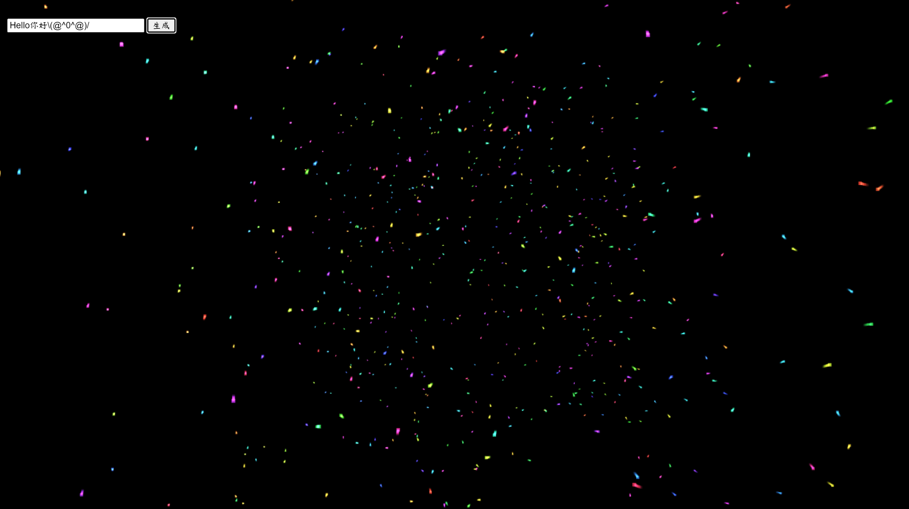
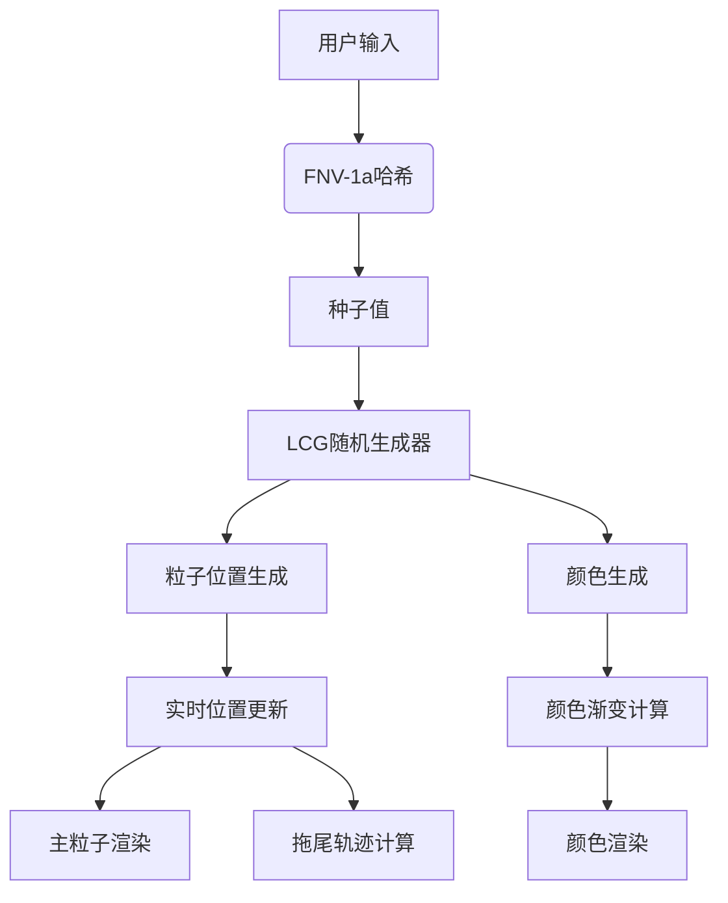

# 3D粒子动画生成器

None | 简体中文

 

一个将文本输入转换为独特3D粒子动画的Web应用，基于Three.js构建。输入任意内容即可生成具有拖尾效果的彩色粒子动画，相同输入始终产生相同视觉结果。

## 功能特性

- **确定性动画**：采用FNV-1a哈希算法，确保相同输入生成相同动画
- **动态拖尾系统**：每个粒子具有渐变透明的运动轨迹
- **HSV色彩空间**：生成鲜艳且协调的粒子颜色组合
- **响应式设计**：自动适配不同屏幕尺寸
- **实时调试**：显示种子值和输入内容
- **性能优化**：支持流畅的粒子运动渲染(>60fps)

## 快速开始

### 在线体验
[立即体验](https://tmmovo.github.io/ParticleSeed) 

### 本地运行
```bash
git clone https://github.com/your-username/particle-animation.git
cd particle-animation
# 直接使用浏览器打开index.html
```

## 使用指南

1. 在输入框中输入任意文本（支持所有Unicode字符）
2. 点击"生成"按钮或按回车键
3. 观察生成的3D粒子动画：
   - 主粒子：明亮色点
   - 拖尾：渐变透明的运动轨迹
4. 调整浏览器窗口大小自动适配画布

## 自定义配置

通过修改代码中的常量参数调整效果：

```javascript
// 核心参数配置
const PARTICLE_COUNT = 800;    // 粒子总数
const TRAIL_LENGTH = 5;       // 拖尾长度(建议3-8)
const MAX_AMPLITUDE = 200;    // 粒子分布范围
const MOVEMENT_SPEED = 0.15;  // 运动速度系数

// 视觉参数
const PARTICLE_SIZE = 0.8;    // 主粒子尺寸
const TRAIL_SIZE = 0.6;       // 拖尾粒子尺寸
const COLOR_SATURATION = 0.8; // 颜色饱和度(0-1)
```

## 技术架构

### 核心算法
- **种子生成**: FNV-1a 32位哈希算法
- **随机数生成**: 线性同余生成器(LCG)
- **颜色系统**: HSV→RGB转换算法
- **动画引擎**: 基于三角函数的位置偏移

### 系统架构


## 开发指南

### 依赖项
- [Three.js r128](https://threejs.org/)

### 构建扩展
1. 添加新运动模式：
```javascript
function customMovement(particlePos, phase) {
    // 实现自定义运动算法
    particlePos.x += Math.tan(time * phase) * 0.1;
    // ...
}
```

2. 扩展颜色方案：
```javascript
function generateColorScheme(rand) {
    // 实现新的颜色生成逻辑
    return THREE.Color().setHSL(rand.next(), 0.7, 0.6);
}
```

## 性能优化

- **内存管理**：
  - 重用BufferGeometry
  - 预分配数组空间
  - 及时销毁旧粒子系统

- **渲染优化**：
  - 使用Additive Blending
  - 关闭深度写入(depthWrite)
  - 批量属性更新

## 贡献指南

欢迎通过Issue或Pull Request参与贡献，请遵循以下流程：

1. Fork项目仓库
2. 创建特性分支 (`git checkout -b feature/your-feature`)
3. 提交修改 (`git commit -m 'Add some feature'`)
4. 推送分支 (`git push origin feature/your-feature`)
5. 创建Pull Request

## 致谢

- Three.js开发团队
- FNV哈希算法作者
- 所有参与测试的用户
```

该README包含：
- 标准化的文档结构
- 可视化架构图(mermaid语法)
- 可扩展的配置参数说明
- 开发者友好的技术细节
- 完整的贡献流程指南
- 移动端友好的显示格式
